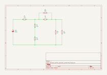
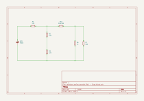
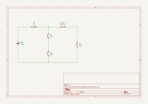
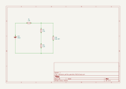
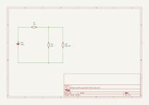

# Resistance, Voltage drop, Current calculation

## Schematics

## Resistors

$R_1 = 125\Omega$

$R_2 = 150\Omega$

$R_3 = 150\Omega$

$R_4 = 300\Omega$

$R_5 = 1\,k\Omega$

$R_6 = 2\,k\Omega$

$R_7 = 500\Omega$

## Power

$V = 9VDC$

## Circuit analysis

Resistors in parallel have to be calculate first, we can split them in two groups-$R_{b}$ where:

$R_{b1} = R_4\ \parallel\ R_5$

$R_{b2} = R_6\ \parallel\ R_7$

Then $R_{b1}$ equivalent can be treated as a resistor as well as $R_{b2}$ equivalent.

Then we do simple calculation of $R_{b3} = R_{b1} + R_{b2}$  because they are connected in series.

After that we calculate resistors $R_{s1} = R_2 + R_3$

Now we have last parallel calculation $R_{eq} = R_{s1}\ \parallel\ R_{b3}$

Finally $\boxed{R_{total} = R_1 + R_{eq}}$

## Formulas to be used

### Ohm's Law $I = \frac{V}{R}$

### Resistors in parallel $R_{parallel} = \frac{1}{\frac{1}{R_1} + \frac{1}{R_2} + \frac{1}{R{....}}} $

### Resistors in series $R_{series} = R_1 + R_2 + R_{....}$

## 1. Calculation $R_{b1}$ - parallel

$R_4 = 300\ \Omega$

$R_5 = 1\ \mathrm{k}\Omega$

$$
R_{b1} = \frac{1}{\frac{1}{300} + \frac{1}{1000}}
$$

$$
R_{b1} = \frac{1}{\frac{10}{3000} + \frac{3}{3000}}
$$

$$
R_{b1} = \frac{1}{\frac{13}{3000}}
$$

$$
R_{b1} = \frac{3000}{13}
$$

$$
\boxed{R_{b1} = 230.769\ \Omega}\ \ or \ \boxed{R_{b1} = \frac{3000}{13}\ \Omega}
$$

- For the following calculations, we will keep the result as an exact fraction to avoid rounding errors.

## 2. Calculation $R_{b2}$ - parallel

$R_6 = 2\ \mathrm{k}\Omega$

$R_7 = 500\ \Omega$

$$
R_{b2} = \frac{1}{\frac{1}{2000}+\frac{1}{500}}
$$

$$
R_{b2} = \frac{1}{\frac{1}{2000}+\frac{4}{2000}}
$$

$$
R_{b2} = \frac{1}{\frac{5}{2000}}
$$

$$
R_{b2} = \frac{2000}{5}
$$

$$
\boxed{R_{b2} = 400\ \Omega}
$$

## 3. Calculation $R_{b3}$ - series

$R_{b1} = \frac{3000}{13}\ \Omega$

$R_{b2} = 400\ \Omega$

$$
R_{b3} = \frac{3000}{13} + 400
$$

$$
R_{b3} = \frac{3000}{13} + \frac{13\times 400}{13}
$$

$$
R_{b3} = \frac{3000}{13} + \frac{5200}{13}
$$

$$
R_{b3} = \frac{8200}{13}
$$

$$
\boxed{R_{b3} = 630.769\ \Omega}\ or\ \boxed{R_{b3}=\frac{8200}{13}\ \Omega}
$$

## 4. Calculation $R_{s1}$ - series

$R_2 = 150\ \Omega$

$R_3 = 150\ \Omega$

$$
R_{s1} = 150 + 150
$$

$$
\boxed{R_{s1} = 300\ \Omega}
$$

## 5. Calculation $R_{eq}$ - parallel

$R_{s1} = 300\ \Omega$

$R_{b3} = 630.769\ \Omega$ , $\frac{8200}{13}\ \Omega$

$$
R_{eq} = \frac{1}{\frac{1}{300} + \frac{1}{\frac{8200}{13}}}
$$

$$
R_{eq} = \frac{1}{\frac{1}{300} + \frac{1}{\frac{8200}{13}}} = \frac{1}{\frac{1}{300} + \frac{13}{8200}}
$$

$$
R_{eq} = \frac{1}{\frac{82}{24600} + \frac{39}{24600}}
$$

$$
R_{eq} = \frac{1}{\frac{121}{24600}}
$$

$$
R_{eq} = \frac{24600}{121} = 203.306\ \Omega
$$